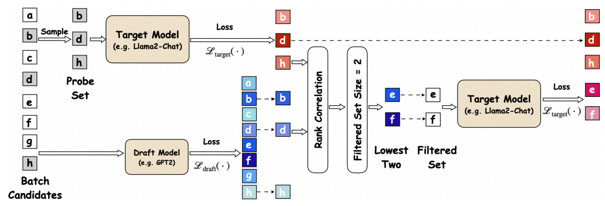

# [NeurIPS 2024] Accelerating Greedy Coordinate Gradient and General Prompt Optimization via Probe Sampling 

This repository contains code for the paper "[Accelerating Greedy Coordinate Gradient and General Prompt Optimization via Probe Sampling](https://arxiv.org/abs/2403.01251)". Below is the workflow of probe sampling.




## Installation

Our codebase comes from the paper [Universal and Transferable Adversarial Attacks on Aligned Language Models](https://arxiv.org/abs/2307.15043) [(github)](https://github.com/llm-attacks/llm-attacks). The package can be installed by running the following command at the root of this repository: 

```
pip install -e .
```

## Parameters

Beyond the parameters of the original GCG, probe sampling necessitates the specification of two additional key parameters: **probe set size** and **filtered set size**, referred to as `probe_set` and `filtered_set`, respectively. These can be configured within `./experiments/launch_scripts/` as follows.

```sh
--config.probe_set=xx \
--config.filtered_set=xx
```

In addition, to combine probe sampling with simulated annealing, modify the `config.anneal` setting in the `./experiments/configs/template.py` file as shown below.

```python
config.anneal=True
```

## Models 

### Target Models

The path to the target model should be specified in `./experiments/configs/`, with `/DIR` representing the directory where the model is stored.

```sh
  config.model_paths = [
      "/DIR/Llama2-7b-chat",
  ]
  config.tokenizer_paths = [
      "/DIR/Llama2-7b-chat",
  ]
```

### Draft Model

The location of the draft model is defined in `./experiments/main.py`; replace `/DIR` with the directory path where the model is stored. Additionally, the GPU on which the draft model is placed is determined by the setting `params_small.devices`.

```python
params_small.model_paths = ["/DIR/GPT2"]
params_small.tokenizer_paths = ["/DIR/GPT2"]
params_small.devices = ['cuda:0']
```

## Experiments

* To execute specific experiments involving harmful behaviors and strings, execute the code below within the `experiments` directory. Note that replacing `vicuna` with `llama2` and substituting `behaviors` with `strings` will transition to alternative experimental configurations:

  ```sh
  cd experiments/launch_scripts
  bash run_gcg_individual.sh vicuna behaviors
  ```
  
  Running this code will enable you to reproduce the results for the **'Human Strings'** dataset and the **'Human Behaviors'** dataset under **Individual** setting as presented in Table 1 of our paper. Specifically, in the context of the Individual Human Behaviors setting, when utilizing probe sampling without simulated annealing under the Llama2-7b-chat model, you will reproduce an ASR of 81.0 and 3.5 times speedup.

- To perform multiple behaviors experiments, run the following code inside `experiments`:

  ```sh
  cd experiments/launch_scripts
  bash run_gcg_multiple.sh vicuna
  ```
  
  Running this code will enable you to reproduce the results for the **'Human Behaviors'** dataset under **Multiple** setting as presented in Table 1 of our paper. Specifically, in the context of the Multiple Human Behaviors setting, when utilizing probe sampling under the Llama2-7b-chat model, you will reproduce an ASR of 96.0 and 5.6 times speedup.
